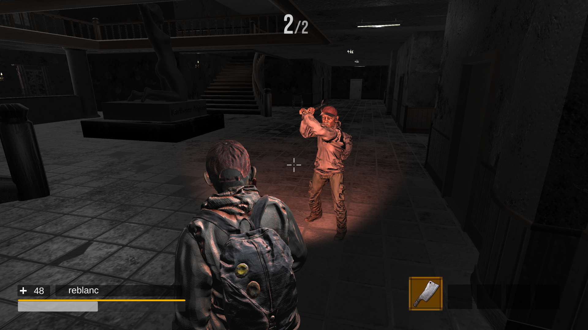
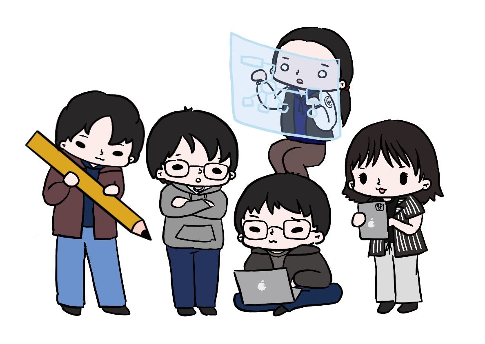

# 볼타 Volta

### 1. 프로젝트 소개
  - 참가자들은 죽음의 레이스에서 서로를 물리치기 위해 최선을 다해야 한다. 대회의 승자에게는 자유와 새로운 삶이 기약되어 있지만, 모든 참가자는 단 한 명만이 살아남을 수 있기에 치열한 전투가 벌어진다.
  
  - 개발 현황 : [Team Notion Link](https://www.notion.so/57a591a23c7d48179644f7f44228c5ec?pvs=4) 에서 자세한 개발 진행 과정을 살펴보실 수 있습니다.

### 2. Abstract
  - In Volta, death row inmates awaken in a mysterious, unfamiliar setting, pushed to fight each other until the last one stands. Players confront various tactical scenarios including scattered batteries, monsters, and special outcomes of digital craftsmanship, whilst their attack and defense.
  Be the last man standing, and be granted with the prize of new life,
  VOLTA.

### 3. 소개 영상

  - [Youtube Video Link](https://www.youtube.com/watch?v=arr2do402LA)

### 4. 팀 소개 

  - ****2805 장원재 bryanwonjaejang@gmail.com
  - ****1822 심현우 shware10@gmail.com
  - ****1907 김유진 wlwlfdl3324@naver.com
  - ****2959 권용재 dydwo0809@naver.com
  - ****5214 최재원 dnjs4475@naver.com

### 5. 사용법
  - 하단 구글 드라이브 링크에 접속하여, 빌드 파일 폴더에 들어가 폴더 전체를 다운로드 받는다.
  - .exe 파일을 실행하면, 별도의 unity 설치 등의 과정을 생략한 채 게임을 플레이할 수 있다.

### 5-1. 게임 플레이 방법
  - ### 게임 플레이를 위해서는 4인의 플레이어가 필요합니다.
  - 서버 capacity 를 낮추어놓아, 매 게임 플레이 후 클라이언트 종료 > .exe 파일 재시작 과정을 거쳐야 합니다.
  - 인게임 플레이 과정 중 TAB 키를 눌러 작동방법을 확인하실 수 있습니다.
  - 크고작은 최적화 버그가 존재할 수 있습니다. 이용에 양해 바랍니다.

### 6. 기타
  - [VOLTA 포스터 다운로드](images/poster.jpg)
  - [VOLTA 중간발표 PPT 다운로드](images/midppt.pptx)
  - [VOLTA 최종발표 PPT 다운로드](images/finalppt.pptx)
  - ### [GOOGLE DRIVE link](https://drive.google.com/file/d/1pyTVlCy_j1QPuflIN8oVaLFeH23Rsjoe/view?usp=sharing)
